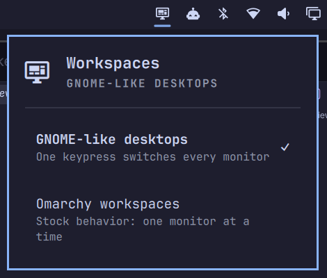
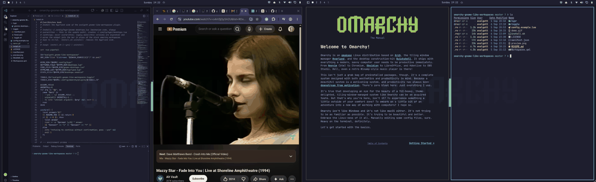

# GNOME-like Workspaces



GNOME-style desktop switching for [Omarchy](https://omarchy.org) (Hyprland):
one bar button per **desktop**, and switching desktops moves **every monitor
at once**. Each monitor keeps its own windows per desktop, and each bar shows
the same focused desktop.

Hyprland normally switches workspaces independently on each monitor; this
plugin makes them behave as one desktop set, like GNOME's "Workspaces span
displays":



It has three parts:

- **Hyprland config** (`hypr/gnome-desktops.lua`) — a Lua module that owns the
  workspace layout and keybindings. Installed to `~/.config/hypr/` by
  `install.sh`.
- **Bar widget** (`Workspaces.qml`) — a Quickshell plugin (this repo's root)
  that draws the desktop buttons and reads its stride/count straight out of
  your settings file, so it never needs per-machine edits.
- **Toggle widget** (`toggle/`) — a second small bar widget installed by
  `install.sh`: a button next to the agents icon that opens a menu to switch
  between this plugin and stock Omarchy workspace behavior at any time.

## Install

```bash
omarchy plugin add https://github.com/avalgott/gnome-like-workspaces.git --enable --yes
bash ~/.config/omarchy/plugins/avalgott.gnome-like-workspaces/install.sh
```

Placement is automatic — the desktop buttons take over the stock workspace
buttons' spot in the left group, and the toggle button goes in the right
group, left of the agents icon. `--yes` skips Omarchy's interactive
"place in which bar section?" prompt (it asks about the workspaces widget,
not the toggle), and `install.sh` enforces the final positions either way.

`install.sh` auto-detects your monitor names, writes a settings file, loads
the module from `hyprland.lua`, reloads Hyprland, swaps out the stock
`omarchy.workspaces` widget, and installs the toggle widget into the right
bar section (left of the agents icon). It is safe to re-run. (`omarchy plugin
add --enable` needs the bar shell to be running; otherwise run install.sh once
more in a graphical session.)

## Settings

Everything you configure lives in **`~/.config/hypr/desktops.lua`** — yours to
edit; install.sh never overwrites it:

```lua
local settings = {
  count = 5,          -- number of desktops (count < stride)
  stride = 10,        -- workspace ids per monitor block
  monitors = { "eDP-2", "HDMI-A-1" },
}
require("hypr.gnome-desktops").setup(settings)
```

- Desktop `N` on monitor slot `S` is workspace `S * stride + N`
  (slot 0 = `1..count`, slot 1 = `stride+1..stride+count`, …).
- Monitors listed keep their slot across replugs; unlisted displays get the
  next free slot, left to right.
- The bar widget parses `count`/`stride` out of this file (keep each on its
  own line, `key = value` form).
- **After editing:** `hyprctl reload`. If you changed `count`, also run
  `omarchy restart shell` (the bar reads the workspace list at startup).

## Toggling: GNOME-like ⇄ stock Omarchy workspaces

The bar has a toggle icon in the right section, immediately left of the agents
icon. Click it and pick a mode:

- **GNOME-like desktops** — this plugin (the default after install).
- **Omarchy workspaces** — the original behavior: one monitor moves at a time,
  stock keybindings and the stock workspace buttons.

The toggle flips both halves together (keybindings + workspace rules, and the
bar widget). The toggle icon itself stays put in both modes — it is the only
way back. The same engine is available from the shell:

```bash
bash ~/.config/omarchy/plugins/avalgott.gnome-like-workspaces-toggle/toggle.sh enable|disable|status
```

Details of each switch:

- The on/off state lives in **`~/.config/hypr/desktops.enabled`**
  (`true`/`false`; written only by toggle.sh; a missing file means enabled).
- **Disabling** merges every window off the secondary monitor blocks onto the
  primary monitor's desktop-number workspaces first, so nothing is stranded
  on workspaces the stock keys can't reach (they cover 1–10). Each monitor is
  then pointed at a distinct stock workspace.
- **Enabling** folds any windows parked on stock pool workspaces past your
  desktop count onto the last desktop, then syncs every monitor to the
  focused desktop.

## Keybindings (replace the stock workspace keys)

| Keys | Action |
|---|---|
| `SUPER + 1..N` | Switch to desktop N — every monitor at once |
| `SUPER + SHIFT + 1..N` | Move the focused window to desktop N (on its own monitor), then follow |
| `SUPER + SHIFT + ALT + 1..N` | Move the focused window silently to desktop N |
| `SUPER + TAB` / `SUPER + SHIFT + TAB` | Next / previous desktop (clamps at the ends) |
| `SUPER + CTRL + TAB` | Back to the former desktop |
| `SUPER + mouse wheel` | Scroll desktops (clamps at the ends) |

Unplugging a monitor merges its windows onto the matching desktop of a
surviving monitor (like GNOME); they stay there when it's plugged back in.

## Update

Never edit files inside the plugin directory — `omarchy plugin update` only
fast-forwards, and any local change there blocks it. All your config lives in
`~/.config/hypr/desktops.lua`. The toggle widget is a plain directory
installed and refreshed by install.sh, so updates are one flow:

```bash
omarchy plugin update avalgott.gnome-like-workspaces --yes
bash ~/.config/omarchy/plugins/avalgott.gnome-like-workspaces/install.sh   # copies the module + toggle widget
```

## Uninstall

```bash
bash ~/.config/omarchy/plugins/avalgott.gnome-like-workspaces/install.sh uninstall
omarchy plugin remove avalgott.gnome-like-workspaces --yes
omarchy plugin enable omarchy.workspaces   # stock workspace buttons, if you want them back
```

`install.sh uninstall` also removes the toggle widget and its state file.

## Caveats

- `omarchy refresh hyprland` regenerates `~/.config/hypr/hyprland.lua` and can
  drop the `require("hypr.desktops")` line — re-run install.sh to restore it.
- The keybindings mirror Omarchy's workspace keys (`keycode = workspace + 9`),
  so if Omarchy changes its binding scheme this needs a matching update.

## Tested

- Omarchy 4.0.2 (Quattro) on Arch Linux, Hyprland 0.56
- Two monitors on an AMD Ryzen 9 + NVIDIA RTX 5080 laptop (the setup in the demo)
- Also installed and exercised on a second machine during development

## Development

This repo's root is the plugin (`manifest.json`), which is what
`omarchy plugin add` clones. Test locally with:

```bash
omarchy plugin validate .
omarchy plugin add . --enable --yes
```

To list the plugin on the marketplace, submit the manifest entry via the
plugin template at plugins.omarchy.org.

## Support

If GNOME-like Workspaces makes your Omarchy setup better, you can help support future fixes and improvements.

<a href="https://buymeacoffee.com/avalgott">
  
</a>

Bug reports, suggestions, and contributions are always welcome.

## License

MIT — see [LICENSE](LICENSE).
